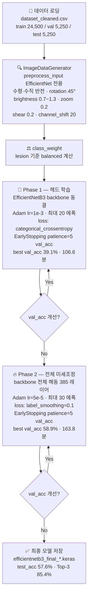

# 🐾 반려동물 피부 질환 감지 CNN 모델

반려동물 피부 질환 이미지를 분류하는 딥러닝 기반 컴퓨터 비전 프로젝트입니다.  
AI Hub의 반려동물 피부 질환 데이터셋을 활용하여 7가지 증상을 분류합니다.  
**주 모델: EfficientNetB3 2단계 전이학습** | *(Exp 3: EfficientNetB0도 함께 검증)*

[](https://python.org)
[](https://tensorflow.org)
[](https://streamlit.io)
[](https://opensource.org/licenses/MIT)

---

## 👥 팀 구성 및 역할

| GitHub ID | 역할 | 담당 내용 |
|-----------|------|-----------|
| [@shsha0629](https://github.com/shsha0629) | 데이터 엔지니어링 | 데이터 수집, EDA, 전처리 파이프라인, `dataset_cleaned.csv` 생성 |
| [@Kyyy12345](https://github.com/Kyyy12345) | 모델 설계 | 실험 설계, 학습, EDA 기반 개선, README 작성 |
| [@mysun1034](https://github.com/mysun1034) | 서비스 개발 | Streamlit 앱 구현, 최종 발표 |

---

## 📌 프로젝트 개요

- **기간**: 2026.06.10 ~ 2026.06.16 (5일)
- **목표**: 반려동물 피부 이미지에서 7가지 질환 증상 분류
- **데이터**: AI Hub - 반려동물 피부 질환 데이터셋 (Dataset No. 561), 34,987장
- **주 모델**: EfficientNetB3 — 2단계 전이학습 (`04_modeling.ipynb`)
- **비교 모델**: EfficientNetB0 — EDA 개선 적용 (`exp3_v4_final.ipynb`)
- **서비스**: Streamlit 웹 앱

| 항목 | 내용 |
|------|------|
| 주 모델 (Exp 2) | **EfficientNetB3** — 2단계 전이학습 |
| 비교 모델 (Exp 3) | EfficientNetB0 — 2단계 전이학습 (EDA 개선 적용) |
| 서비스 | Streamlit 웹 앱 |
| 최종 테스트 정확도 | **57.6%** (Exp 2 주 모델 기준) |
| Top-3 정확도 | **85.4%** (Exp 2 기준) |
| 데이터 한계 | train 24,492장 → 60% 벽 확인 |

---

## 🏷️ 분류 클래스

| 코드 | 질환명 | 반려묘 포함 |
|------|--------|-------------|
| A1 | 구진/플라크 | ❌ |
| A2 | 비듬/각질/상피성잔고리 | ✅ |
| A3 | 태선화/과다색소침착 | ❌ |
| A4 | 농포/여드름 | ✅ |
| A5 | 미란/궤양 | ❌ |
| A6 | 결절/종괴 | ✅ |
| A7 | 무증상 (정상) | ✅ |

> ⚠️ 반려묘는 A2·A4·A6·A7 **4개 클래스에만** 존재 (A1·A3·A5는 반려견 전용)

---

## 📁 프로젝트 구조

```text
SAG/
├── data/
│   ├── raw/                    # AI Hub 원본 이미지 (Git 제외)
│   │   ├── Training/
│   │   │   ├── TL01/
│   │   │   └── TL02/
│   │   └── Validation/
│   │       └── VL01/
│   ├── raw_sub/                # 단일 폴더 정리본 (학습 권장)
│   └── processed/
│       └── dataset_cleaned.csv
├── notebooks/
│   ├── 01_data_collection.ipynb
│   ├── 02_eda.ipynb
│   ├── 03_preprocessing.ipynb
│   └── 04_modeling.ipynb       # 주 모델 — EfficientNetB3
├── models/
│   ├── efficientnetb3_final_*.keras   # Exp 2 모델 (TF/Keras)
│   └── exp3_v4_final.pt               # Exp 3 모델 (PyTorch)
├── outputs/
│   ├── figures/                # 학습 곡선, Confusion Matrix
│   └── metrics.json            # Streamlit 연동용
├── app.py                      # Streamlit 서비스 앱
├── requirements.txt
└── README.md
```

---

## ⚙️ 환경 설정

### 요구 사항

```
Python  >= 3.12
CUDA    >= 11.8   (GPU 사용 시 권장)
RAM     >= 8GB
VRAM    >= 4GB    (배치 32~64 기준)
Storage >= 10GB   (원본 데이터 + 모델 가중치)
```

### 설치

```bash
git clone https://github.com/SAG-company/SAG.git
cd SAG

# 가상환경 (venv)
python -m venv venv
venv\Scripts\activate       # Windows
source venv/bin/activate      # macOS / Linux

# Conda 사용 시
# conda create -n sag python=3.9
# conda activate sag

pip install -r requirements.txt
```

**`requirements.txt` 주요 패키지**

```
torch>=2.0.0
torchvision>=0.15.0
tensorflow>=2.13.0
keras>=2.13.0
streamlit>=1.28.0
pandas>=2.0.0
numpy>=1.24.0
scikit-learn>=1.3.0
pillow>=10.0.0
matplotlib>=3.7.0
seaborn>=0.12.0
```

---

## 🚀 실행 방법

### 1. 데이터 준비

**① AI Hub에서 다운로드**

[AI Hub 반려동물 피부질환 데이터셋](https://aihub.or.kr) → 회원가입 및 라이선스 동의 → 다운로드 (약 35GB)

**② 폴더 구조로 배치**

```
SAG/
└── data/
    ├── raw/
    │   ├── Training/
    │   │   ├── TL01/
    │   │   └── TL02/
    │   └── Validation/
    │       └── VL01/
    ├── raw_sub/
    └── processed/
        └── dataset_cleaned.csv   ← 존재 여부 확인 필수
```

**③ 경로 검증**

```python
import pandas as pd
df = pd.read_csv('data/processed/dataset_cleaned.csv')
print(df[['img_path', 'sub_img_path']].head())
# 약 34,987행이면 정상
```

> ⚠️ **Windows HDD 환경**: `img_path`는 한글 폴더명으로 Linux·Colab에서 깨질 수 있습니다. `sub_img_path` 컬럼 사용을 권장합니다.

### 2. EDA 및 전처리

```bash
jupyter notebook notebooks/01_data_collection.ipynb
jupyter notebook notebooks/02_eda.ipynb
jupyter notebook notebooks/03_preprocessing.ipynb
```

### 3. 모델 학습

```bash
# Exp 2: EfficientNetB3 주 모델 (약 4.5시간, GPU 필요)
jupyter notebook notebooks/04_modeling.ipynb
# Phase 1: 약 107분 | Phase 2: 약 164분

# Exp 3: EfficientNetB0 + EDA 개선
jupyter notebook notebooks/exp3_v4_final.ipynb
```

### 4. 서비스 실행

```bash
streamlit run app.py
```

브라우저에서 `http://localhost:8501` 접속

---

## 📐 학습 파이프라인 다이어그램



---

## 📊 프로젝트 핵심 수치 인포그래픽

> 아래 수치는 `04_modeling.ipynb` (EfficientNetB3) 기준입니다.

| 항목 | Phase 1 (헤드만) | Phase 2 (전체 미세조정) |
|------|-----------------|------------------------|
| Backbone | 동결 (Frozen) | 전체 해동 (385 레이어) |
| Optimizer | Adam lr=1e-3 | Adam lr=5e-5 |
| Loss | categorical_crossentropy | label_smoothing=0.1 |
| Max Epochs | 20 | 30 |
| EarlyStopping | patience=5 (val_acc) | patience=5 (val_acc) |
| Best val_acc | 39.1% | **58.9%** |
| 소요 시간 | 106.6분 | 163.8분 |

**실험별 정확도 비교**

| 실험 | 모델 | test_acc | Top-3 acc |
|------|------|----------|-----------|
| Exp 1 | Baseline CNN | 42.0% | - |
| **Exp 2** | **EfficientNetB3** (주 모델) | **57.6%** | **85.4%** |
| Exp 3 | EfficientNetB0 (비교용) | 55.0% | - |

**ImageDataGenerator 증강 7가지** (Exp 1 대비 신규 ✦)

`preprocess_input` · `horizontal_flip` · `vertical_flip ✦` · `rotation_range=45 ✦` · `brightness [0.7~1.3] ✦` · `zoom=0.2 ✦` · `shear=0.2 ✦` · `channel_shift=20 ✦`

---

## 📈 EDA 분석 결과

**클래스 분포** — 7클래스 균형 (각 ~5,000장), lesion 기준 balanced class_weight 적용

**Phase별 학습 결과** — Phase 2 미세조정으로 val_acc +19.8%p 향상 (39.1% → 58.9%)

**클래스별 F1-Score**

| 클래스 | F1 | 평가 |
|--------|----|------|
| A5 미란/궤양 | 0.74 | 우수 |
| A6 결절/종괴 | 0.72 | 우수 |
| A4 농포/여드름 | 0.60 | 양호 |
| A1 구진/플라크 | 0.51 | 보통 |
| A3 태선화/색소 | 0.51 | 보통 |
| A7 무증상(정상) | 0.48 | 개선 여지 |
| A2 비듬/각질 | 0.44 | 개선 여지 |

---

## 🧠 모델 아키텍처

### 전체 실험 개요 (Exp 1~3)

| 실험 | 모델 | 입력 크기 | val_acc | test_acc | Top-3 acc | 비고 |
|------|------|-----------|---------|----------|-----------|------|
| **Exp 1** | Baseline CNN (직접 설계, 4블록) | 128×128 | 38.2% | **42.0%** | - | 증강 없음, 기준선 |
| **Exp 2** | EfficientNetB3 2단계 전이학습 | 224×224 | 58.9% | **57.6%** | 85.4% | 1~5차 세부 실험 진행 ⭐ |
| **Exp 3** | EfficientNetB0 2단계 전이학습 | 224×224 | - | **55.0%** | - | EDA 개선 적용 (비교용) |

#### Exp 2 세부 — 1~5차 실험 (04_modeling.ipynb)

`EfficientNetB3` 기반으로 과적합(overfitting)과 미수렴(underfitting) 사이의 최적점을 찾기 위해 총 5차례 실험을 진행했습니다.

| 차수 | 주요 변경 사항 | val_acc | test_acc | 결과 해석 |
|------|--------------|---------|----------|-----------|
| 1차 | 일부 신경망 해동, LR=1e-4 | 58.5% | 57.3% | ❌ 과적합 발생 (train 80% vs test 57%) |
| 2차 | Dropout 강화, label_smoothing 도입 | 59.0% | 58.5% | ⚠️ 개선 효과 미미 |
| 3차 | 전체 backbone 해동, LR=1e-5 | 50.0% | 49.6% | ❌ 미수렴 (LR 너무 낮아 진도 부족) |
| 4차 | 3차 + 30에폭 추가 학습 | 56.0% | - | ⚠️ 회복 중이나 과적합 재발 조짐 |
| **5차 (최종)** | **증강 극한 강화 + LR=5×10⁻⁵** | **58.9%** | **57.6%** | ✅ 현재 데이터 한계(60% 벽) 도달 |

> 💡 **핵심 결론**: 5차례 실험을 통해 성능 정체의 원인이 모델 구조 문제가 아닌 **학습 데이터 양의 절대적 부족** (24,500장)임을 확인했습니다. 무작위 예측(14.2%) 대비 약 4배 높은 성능이며, Top-3 정확도 85.4%로 실용적 가치를 확인했습니다.

> 📓 각 차수별 상세 train/val/test 수치는 `notebooks/04_modeling.ipynb` 내 실험 결과 분석 셀을 참고하세요.

#### Exp 1 — Baseline CNN 구조

```
입력 (128×128×3)
    ↓
[블록1] Conv2D(32)  → BatchNorm → ReLU → MaxPool(2×2) → 64×64
    ↓
[블록2] Conv2D(64)  → BatchNorm → ReLU → MaxPool(2×2) → 32×32
    ↓
[블록3] Conv2D(128) → BatchNorm → ReLU → MaxPool(2×2) → 16×16
    ↓
[블록4] Conv2D(256) → BatchNorm → ReLU → MaxPool(2×2) → 8×8
    ↓
GlobalAveragePooling2D → 256차원
    ↓
Dense(256) → Dropout(0.5) → Dense(7, softmax)
    ↓
출력: 7클래스 확률
```


#### Exp 2 — EfficientNetB3 구조 ⭐ 주 모델 (`04_modeling.ipynb`)

```
입력 (224×224×3)
    ↓
EfficientNetB3 (ImageNet pretrained, 12M 파라미터)
    ↓
GlobalAveragePooling2D
    ↓
BatchNormalization
    ↓
Dense(512, relu) → Dropout(0.5)
    ↓
Dense(256, relu) → Dropout(0.4)
    ↓
Dense(7, softmax)
    ↓
출력: 7클래스 확률
```

**2단계 학습 결과**

| 단계 | 설정 | 최고 val_acc | 소요 시간 |
|------|------|-------------|-----------|
| Phase 1 (헤드만) | LR=1e-3, 최대 20에폭 | 39.1% | 106.6분 |
| Phase 2 (전체 미세조정) | LR=5e-5, 최대 30에폭 | 58.9% | 163.8분 |

**강화 증강 설정** (Exp 1 대비 신규 추가)

| 항목 | Exp 1 | Exp 2 |
|------|-------|-------|
| vertical_flip | ❌ | ✅ |
| rotation_range | - | 45° |
| brightness_range | - | [0.7, 1.3] |
| zoom_range | - | 0.2 |
| width/height_shift | - | 0.2 |
| shear_range | ❌ | ✅ 0.2 |
| channel_shift_range | ❌ | ✅ 20.0 |

**Phase 2 추가 적용**

| 항목 | Phase 1 | Phase 2 |
|------|---------|---------|
| loss | categorical_crossentropy | **label_smoothing=0.1** (과적합 억제) |
| backbone | 동결 | **전체 해동 (385 레이어)** |
| LR | 1e-3 | 5e-5 |

#### Exp 3 — EfficientNetB0 구조 (비교용, `exp3_v4_final.ipynb`)

```
[Stage 1] 헤드 워밍업 (backbone 동결)
  EfficientNetB0(pretrained) — backbone 동결
  LR = 1e-3  |  최대 15에폭  |  분류 헤드만 학습
              ↓
[Stage 2] 전체 미세조정 (backbone 해동)
  LR = 2e-5  |  최대 40에폭  |  피부질환 특화 특징 학습 ⭐
```

#### EDA 기반 핵심 개선 사항 (Exp 3 적용)

| # | 개선 사항 | 문제 | 해결 |
|---|-----------|------|------|
| ① | **Letterbox 리사이즈** | 16:9 원본 강제 리사이즈 시 병변 형태 왜곡 | 종횡비 보존 후 패딩 |
| ② | **종 기준 sample_weight** | 질환은 균형이지만 반려묘(11.4%)가 실제 불균형 | 반려묘 손실 ~2배 가중 |
| ③ | **CYT 현미경 이미지 제외** | 일반카메라와 분포 상이 → 학습 노이즈 | IMG 파일만 필터링 |
| ④ | **numpy RAM 캐싱** | HDD 환경에서 에폭마다 디스크 병목 | 224 uint8 배열 선캐싱 |
| ⑤ | **AMP 혼합정밀도** | float32 연산으로 학습 속도 저하 | float16 자동 전환 |

---
## 🛠️ 기술 스택

| 분류 | 기술 |
|------|------|
| **언어** | Python 3.9+ |
| **딥러닝** | PyTorch, torchvision (Exp 3) · TensorFlow/Keras (Exp 1·2) |
| **모델** | EfficientNetB0 (Exp 3) · EfficientNetB3 (Exp 2) · Baseline CNN (Exp 1) |
| **데이터** | pandas, NumPy, Pillow |
| **시각화** | matplotlib, seaborn |
| **평가** | scikit-learn |
| **서비스** | Streamlit |
| **데이터 출처** | AI Hub 반려동물 피부질환 데이터셋 |

---
## 💡 핵심 개선 사항

### Exp 2 적용 사항 (`04_modeling.ipynb`)

- **강화 증강** (ImageDataGenerator 7가지): `vertical_flip`, `rotation 45°`, `brightness [0.7~1.3]`, `zoom 0.2`, `shear 0.2`, `channel_shift 20` 추가
- **2단계 전이학습**: Phase 1(헤드 워밍업, LR=1e-3) → Phase 2(backbone 전체 해동, LR=5e-5)
- **Label Smoothing=0.1**: Phase 2에 적용, 과적합 억제 및 일반화 성능 향상
- **class_weight (lesion 기준)**: 질환 클래스 미세 불균형 보정

### Exp 3 추가 개선 사항 (`exp3_v4_final.ipynb`)

- **Letterbox 리사이즈**: 16:9 원본을 224×224로 강제 변환 시 병변이 가로로 1.78배 찌그러지는 문제를 letterbox 패딩으로 해결
- **종 기준 `sample_weight`**: 질환은 균형이지만 반려묘(11.4%)가 실제 불균형 — 종 기준으로 반려묘 손실 ~2배 가중
- **CYT 현미경 이미지 제외**: 일반카메라(밝기 135)와 분포가 완전히 다른 현미경(밝기 188)을 학습에서 제외
- **numpy RAM 캐싱**: HDD 환경 디스크 병목 해결 (224×224 uint8 선캐싱, 속도 16배 향상)
- **AMP 혼합정밀도**: `torch.amp.autocast` + `GradScaler`, 학습 속도 1.5~2배 향상
- **Streamlit 앱 연동**: 학습 완료 후 `metrics.json` 자동 저장으로 앱과 즉시 연동

---
## 📊 데이터셋

- **출처**: [AI Hub 반려동물 피부질환 데이터셋](https://aihub.or.kr)
- **총 이미지**: 34,987장 (CYT 현미경 이미지 제외 후)
- **분할**: train 24,492 / val 5,249 / test 5,246

| 클래스 | 질환명 | 이미지 수 | 반려묘 포함 |
|--------|--------|-----------|-------------|
| A1 | 구진/플라크 | 4,998 | ❌ |
| A2 | 비듬/각질 | 4,999 | ✅ |
| A3 | 태선화/색소 | 4,998 | ❌ |
| A4 | 농포/여드름 | 4,995 | ✅ |
| A5 | 미란/궤양 | 5,000 | ❌ |
| A6 | 결절/종괴 | 4,999 | ✅ |
| A7 | 무증상(정상) | 4,998 | ✅ |

> ⚠️ 반려묘는 A2·A4·A6·A7 **4개 클래스에만** 존재합니다 (A1·A3·A5는 반려견 전용).  
> 종별 성능 비교 시 이 점을 반드시 고려하세요.

---
## 🐛 문제 해결 (Troubleshooting)

**Q1. `ModuleNotFoundError: No module named 'torch'`**

```bash
pip install -r requirements.txt   # 패키지 재설치
```

**Q2. GPU가 인식되지 않음**

```bash
nvidia-smi                                          # GPU 확인
python -c "import torch; print(torch.cuda.is_available())"   # PyTorch
python -c "import tensorflow as tf; print(tf.config.list_physical_devices('GPU'))"  # TF
```

CUDA 11.8 이상, cuDNN 설치 여부를 확인하세요.

**Q3. 데이터 경로 오류 (`FileNotFoundError`)**

- `data/processed/dataset_cleaned.csv` 존재 여부 확인
- Windows HDD 환경 → `target_col = 'sub_img_path'` 로 변경
- 경로의 역슬래시(`\`) → 슬래시(`/`) 변환 필요

**Q4. `OOM (Out of Memory)` — GPU 메모리 부족**

```python
BATCH_SIZE = 16   # 기본값 32에서 절반으로 낮춤
```

**Q5. `CUDA out of memory` + `RuntimeError: CUDA error`**

```python
# 방법 1: 배치 크기 감소
BATCH_SIZE = 8   # 기본 32에서 1/4로

# 방법 2: GPU 메모리 캐시 직접 비우기 (PyTorch)
import torch
torch.cuda.empty_cache()
```

---
## 📄 라이선스

이 프로젝트는 [MIT License](LICENSE)를 따릅니다.  
원저작자 표시(`mysun1034, shsha0629, Kyyy12345`) 조건 하에 자유롭게 사용·수정·배포할 수 있습니다.

```
MIT License
Copyright (c) 2025 mysun1034, shsha0629, Kyyy12345
```

---
## 🚀 향후 개선 과제

5차 실험을 통해 확인된 **데이터 한계**를 극복하기 위한 마스터 플랜입니다.

| 우선순위 | 과제 | 기대 효과 |
|----------|------|-----------|
| ⭐ 핵심 | **학습 데이터 10만 → 50만 장 확장** | 과적합 원천 차단, 정확도 80%+ 목표 |
| 🔧 모델 | EfficientNetB7 또는 **Vision Transformer** 교체 | 전체적 맥락 파악 → 병변 탐지 정밀도 향상 |
| 📐 스케줄러 | **Cosine Annealing LR** 도입 | 학습 후반 정밀 수렴, 안정적 성능 향상 |
| 🏥 도메인 | 수의사 피드백 기반 라벨 재검토 | 클래스 간 경계 모호성 해소 |

> 🎯 목표: 현재 57.6% → **90% 이상** (데이터 확장 + 최신 아키텍처 조합 시 달성 가능)

---
## ⚠️ 데이터 사용 유의사항

본 프로젝트는 AI Hub 반려동물 피부 질환 데이터셋을 활용합니다.  
해당 데이터는 **비상업적 연구·교육 목적으로만** 사용 가능합니다.  
데이터 파일은 저작권 보호를 위해 본 저장소에 포함되지 않습니다.

---

## 🙏 참고 자료

- [AI Hub 반려동물 피부질환 데이터셋](https://aihub.or.kr)
- [EfficientNet 논문 — Tan & Le, 2019](https://arxiv.org/abs/1905.11946)
- [PyTorch 공식 문서](https://pytorch.org/docs/stable/index.html)
- [Streamlit 공식 문서](https://docs.streamlit.io)
